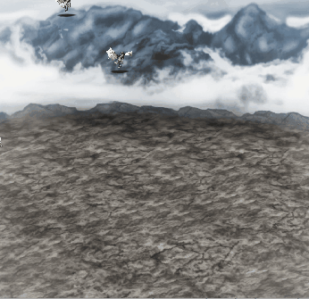

# Flutter Flame Character Spawn 2

Spawn characters indefinitely.

## More Tutorials

* [23 Flutter Flame Tutorial Videos](https://youtube.com/playlist?list=PLxvyAnoL-vu49mglrFB5_GlubMWzYqp68) - All free (this is a hobby)

## Learning Concepts

* load image from cache instead of continually hitting network or disk
to load image for every spawn
* `Tappable` mixin on `SpriteComponent`
* by using `Tappable`, you can remove the dragon with a `remove()`
method specific to each dragon
* `HasTappableComponents` mixin on `BaseGame` - needed to use
`Tappable` in the `SpriteComponent`
* `Timer` utility from Flame to control the rate of dragon spawn

## Build Environment

* Dart 2.14.0
* Flutter 2.5
* Flame 1.0.0-releasecandidate.13
